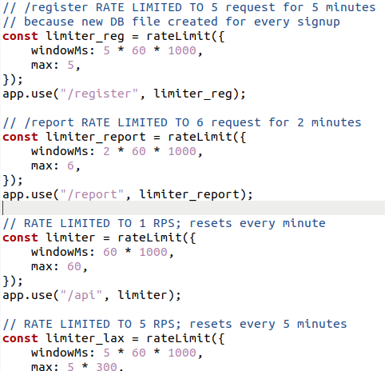

<h1>Challenge Report</h1>

The challenge is hosted at http://<machine_ip>:1337 on my Azure virtual machine.

The site is a small book library holding upto 10 books with their name, author name and nummber of pages.It has a login form and registration and logging in is required by registering a user.
On logging in it gets 5 random books. There are options to Add books and a search feature.

Liteshare: On clicking a book's name in the library a page opens up with the url as : ip:1337/liteShare/<username>/bookId. 
If logged in as another user and open the url a report option with input for reason for report comes up.

On going thorugh the javascript file afterr logging in we see somme endpoints defined. The /stats and /report seem interesting. 
/stats upon opening gives a JSON response where we can see the headers set for this application.
The X-XSS-Protection is set to 0 and CSP is set to : ```default-src 'self' openlibrary.org;img-src 'self' raw.githubusercontent.com external-content.duckduckgo.com;base-uri 'self';font-src 'self' https: data:;form-action 'self';frame-ancestors 'self';object-src 'none';style-src 'self' https: 'unsafe-inline'```
These show potential methods of inflitrating the application using CSP bypass ans XSS.

There are many methods of CSP bypass so am looking into which particular method will work for this application.
Going thorugh https://book.hacktricks.xyz/pentesting-web/content-security-policy-csp-bypass.

JSONP seems like a possible exploit to run javascript code.Trying to figure out how it works and what payload I can use.	
Also reading other possible methods to exploit.

On reading the source files these were the observation:
sqlite3 is used as database engine.But sql injection is not directly possible because:
JS objects are being used to store the inputs first.
Then prepared statements are being used to create the sql queries.
/delete is using a blacklist ```const BLACKLIST = ["delete", "update", "drop", "insert", "view", "sleep"];``` for the title.

There are also the following rate-limits:


In username only lowercase and numbers allowed and between 5-30 characters
In password Lowercase,uppercase,numbers and certain symbols allowed. Length between 5-60 characters.


The utils.js file has an admin bot. And there is a user name admin whose hashed password is given in the source.
Current thought: I have to find a JSONP endpoint in the allowed sites mentioned in the CSP and add that as an XSS when adding a new book to execute some js code to log in as the admin.

Tried: <style>body {background-color: red !important;}</style> in Add Books and it did work for the page.

As script-src is default , scripts from openlibrary.org will be allowed if I can find a JSONP endpoint in it.
