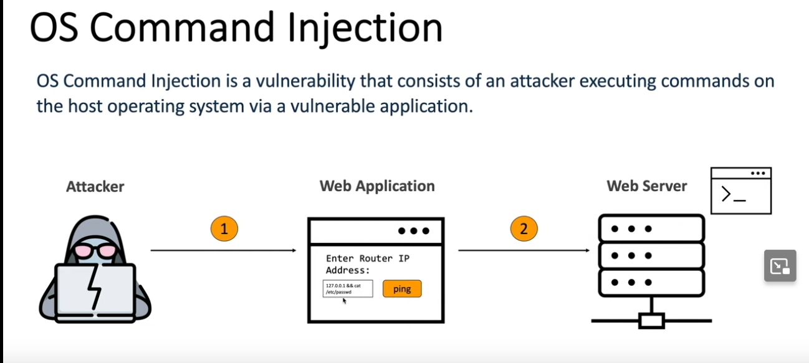

<h1>What is it</h1>

Injecting system commands into input in ways not allowed to like bypassing blacklists or chaining commands.
In Command Injection, the attacker extends the default functionality of the application, which execute system commands, without the necessity of injecting code.
Eg: If there is an input for ping tester with input box try doing ```IP && cat /etc/passwd``` if already identified that underlying is Linux.



Now this can show output or not. Depending on that have to try differen payloads to see if it is executing but just not showing output.

<h1>Baby steps</h1>

Identify user controlled input fields and try to get a mental map of how the application functions. 

If output displayed:
Try chaining commmands using shell meta characters.

if going in blind methods you can look into are:
Using ``` <safe_input> && sleep 10 & ``` (Only for linux) command or ```<safe_input> && ping -c 10 127.0.0.1 & ```(Inter OS) and see if output adheres to the time delay.
If it does you can then try to use other methods to exfiltrate more data like try to run `whoami` and rediect the output.
Placing the additional command separator & after the injected command is useful because it separates the injected command from whatever follows the injection point. 
This reduces the chance that what follows will prevent the injected command from executing. 

![redirection[(redirection.png)

https://www.makeuseof.com/what-are-linux-metacharacters/
https://www.bogotobogo.com/Linux/linux_shell_programming_tutorial7_metacharacters_quotes.php
https://github.com/payloadbox/command-injection-payload-list

