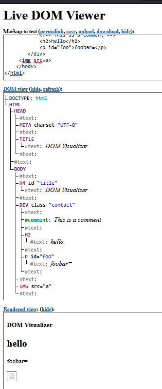
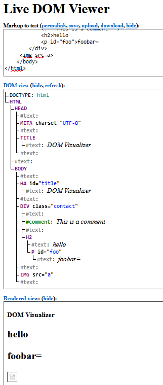
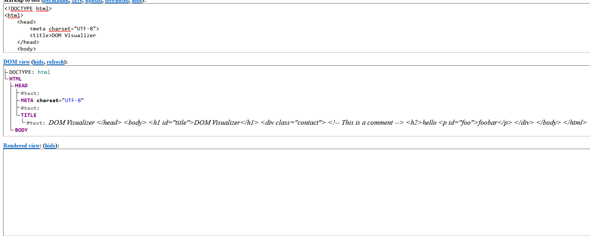

What is dompurity -

    Configuration, what to allow, what not
	
	 #intro#
	 DOMPurify is a DOM-only, super-fast, uber-tolerant XSS sanitizer for HTML, MathML and SVG.
	 It is basically a security mechanism to sanitize user inputs and get clean HTML code. 
	 It required a DOM to work and preffered dom is jsdom. It is used as it is simple to implement and does not cause much overhead.
	 
	 #Usage# 
	 How to use:
	 
	```
	const createDOMPurify = require('dompurify');
	const { JSDOM } = require('jsdom');
	const window = new JSDOM('').window;
	const DOMPurify = createDOMPurify(window);
	const clean = DOMPurify.sanitize('<b>hello there</b>');
	```
	
	How not to use:
	
	```
	import DOMPurify from 'dompurify';
	
	let userComment = '';
	let cleanComment = DOMPurify.sanitize(userComment);
	cleanComment += '<p>Thank you for your comment!</p>';
	document.getElementById('comments').innerHTML = cleanComment;
	```
	The good version of the above would be:
	
	```
	import DOMPurify from 'dompurify';

	let userComment = '';

	let cleanComment = DOMPurify.sanitize(userComment);
	
	document.getElementById('comments').innerHTML = cleanComment;

	document.getElementById('comments').innerHTML += '<p>Thank you for your comment!</p>';
	```
	 
	 #configs#
	 DOMpurify has a lot of configuration options which can be used to fine tune each aspect you want.	
	 It works on whitelists for attributes and tags which can be found [here](https://github.com/cure53/DOMPurify/tree/main/src). 
	 Any attribute or tag outside of this is directly blocked unless specifically configured to be allowed.
	 That can be done like this:
	 `const clean = DOMPurify.sanitize(dirty, {ALLOWED_TAGS: ['b', 'q'], ALLOWED_ATTR: ['style']});`
	 Using a similar syntax you can configure different aspects of dompurify like forbidding some tags, 
	 adding custom attributes or tags to the whitelists,changing if only a certain profile should be filtered etc.
	 Eg:
	 
	 ```
			 // allow all safe SVG elements and SVG Filters, no HTML or MathML
		const clean = DOMPurify.sanitize(dirty, {USE_PROFILES: {svg: true, svgFilters: true}});

		// leave all safe HTML as it is and add <style> elements to block-list
		const clean = DOMPurify.sanitize(dirty, {FORBID_TAGS: ['style']});

		// leave all safe HTML as it is and add style attributes to block-list
		const clean = DOMPurify.sanitize(dirty, {FORBID_ATTR: ['style']});

		// extend the existing array of allowed tags and add <my-tag> to allow-list
		const clean = DOMPurify.sanitize(dirty, {ADD_TAGS: ['my-tag']});
	 ```
	 Other customization demos can be found [here](https://github.com/cure53/DOMPurify/tree/main/demos).
	
#Math tags
The element is used to include math expressions in the current line. It is designed for the usage with MathML.
It is just one of many other MathML tags like maction,mglyph etc but 
whatever MathML element you want to use should be wrapped inside of the <math> tag.

what are glyphs?
Glyphs are basically special characters in html already defined and can be displayed by their alpha,decimal or hex definations. 

Eg : `&pound;	&#163;	&#xA3;`	= &pound;

There is also a MathML tag called `mglyph` used to display non-standard symbols where existing 
Unicode characters are not available but it has not been supported by any browsers.

WHat is dom:

The Document Object Model (DOM) is a programming API for HTML and XML documents.
It defines the logical structure of documents and the way a document is accessed and manipulated. 
In the DOM specification, the term "document" is used in the broad sense - increasingly, XML is being used as a way of representing many 
different kinds of information that may be stored in diverse systems, and much of this would traditionally be seen as data rather than as documents. 
Nevertheless, XML presents this data as documents, and the DOM may be used to manage this data.

With the Document Object Model, programmers can create and build documents, navigate their structure, and add, modify, or delete elements and content.
Anything found in an HTML or XML document can be accessed, changed, deleted, or added using the Document Object Model, with a few exceptions.
 
It is genrally thought of as an in-memory DOM tree made from the html elements.Each branch of the tree ends in a node, and each node contains objects.
DOM methods allow programmatic access to the tree. With them, you can change the document's structure, style, or content.
As a W3C specification, one important objective for the Document Object Model is to provide a standard programming
interface that can be used in a wide variety of environments and applications. 
The Document Object Model can be used with any programming language.
Nodes can also have event handlers attached to them. Once an event is triggered, the event handlers get executed.

One important property of DOM tree is structural isomorphism: if any two Document Object Model implementations are used 
to create a representation of the same document, they will create the same structure model, with precisely the same objects and relationships.

what's a dom parser:
A DOM parser is a particular implementation which is used to parse(or convert) XML or HTML source code from a string into a DOM Document.
Different parsers implement this parsing differently and there are multiple different parsers developed by different browsers,frameworks etc.

A dom parser allows to convert the raw string HTML or XML into a object structure which can be programatically manipulated.
However, because the DOM parser loads the entire document into memory, it can be inefficient for large documents. 
For such cases, other types of parsers like SAX (Simple API for XML) or streaming parsers may be more appropriate. 

How?

When you give an HTML document to a parser, it goes through several steps:

Tokenization: The parser reads the HTML text and identifies the different types of tokens - start tags, end tags, attribute names and values, text, etc.
Tree Construction: The parser uses these tokens to build a tree-like structure representing the HTML document. Each element, attribute, and piece of text in the HTML becomes a node in the DOM tree.
Correction of Errors: If the HTML is not well-formed (e.g., tags are not properly nested), the parser attempts to correct the errors and build a valid DOM tree.

Errors:
The error handling in a DOM parser is typically handled by the parsing algorithm itself, which is designed to be forgiving of errors in HTML documents.
This is because many web pages on the internet have small errors in their HTML, and browsers need to be able to display these pages correctly.

When a DOM parser encounters an error like , it tries to correct the error by making an educated guess about what the author intended.
In this case, it might correct it to . This process is often referred to as “tag soup” parsing, a term that comes 
from the idea of HTML as a “soup” of open and close tags.

The exact details of how errors are handled can vary between different parsers, but many follow the standards set out in the HTML specification. 


choose a dom parser, preferably one using by browsers/dompurify and illustrate how 
1 a good html
2 a bad html i.e. one missing quotes, opening, closing tags
gets rendered

Good:

```
<!DOCTYPE html>
<html>
    <head>
        <meta charset="UTF-8">
        <title>DOM Visualizer</title>
    </head>
    <body>
        <h1 id="title">DOM Visualizer</h1>
        <div class="contact">
            <!-- This is a comment -->
            <h2>hello</h2>
            <p id="foo">foobar</p>
        </div>
		
    </body>
</html>
 ```      
Bad:
```
<!DOCTYPE html>
<html>
    <head>
        <meta charset="UTF-8">
        <title>DOM Visualizer</title>
    </head>
    <body>
        <h4 id="title">DOM Visualizer</h4>
        <div class="contact">
            <!-- This is a comment -->
            hello</h2>
            <p id="foo">foobar=
        </div>
     
    </body>
</html>
```

Gets converted to :

```
<!DOCTYPE HTML><html><head>
        <meta charset="UTF-8">
        <title>DOM Visualizer</title>
    </head>
    <body>
        <h4 id="title">DOM Visualizer</h4>
        <div class="contact">
            <!-- This is a comment -->
            hello
            <p id="foo">foobar=
        </p></div>
     
 </body></html>
 
 ```  
Render views:



