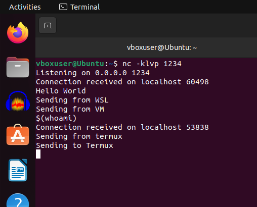

<h1>JSOPN callback links</h1>

```
<script src="https://m.addthis.com/live/red_lojson/100eng.json?callback=alert('SELECT sleep')"></script>
<script src="https://www.youtube.com/oembed?url=fake&format=json&callback=alert('SELECT sleep')"></script>
```

https://github.com/zigoo0/JSONBee/blob/master/jsonp.txt : Many other endpoints

<h1>NGROK</h1>




- Accessing files if read permission
  If have access to read files in a system via a script running in the directory where challenge in running, can use `/proc/self/cwd/flag.txt`.
  /proc/self/cwd/flag.txt refers to the file named “flag.txt” located in the current working directory of the process that accesses it. 

The /proc directory is a special directory in Linux that provides an interface to kernel data structures.
It contains information about processes, system configuration, and other system-related details.

Self is symlink to current process, cwd meads current working diirectory.

So like: 

```
print(requests.request("GET", URL+"/api/file?filename=/proc/self/cwd/flag.txt", headers={'Cookie': f'session={session_cookie}'}).text)
```

- Making a bot run long:
`await new Promise((resolve) => setTimeout(resolve, 9999999));`

-Sql injection notes:

You can put NULL if you don't know the column name of a database. If using UNION and do not know the number of columns you could try to manually put NULL,NULL,NULL,... as many until you get some kind of valid response
Eg : 2 UNION SELECT NULL,NULL,NULL,NULL
Now to find out the type of database if it's not returning back error codes you could try to put @@VERSION instead of NULL and then search what you get back
