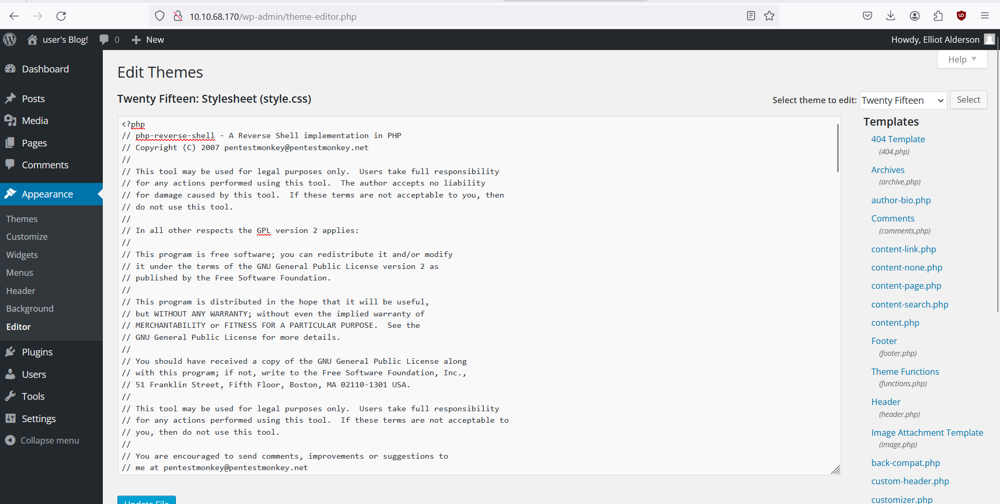
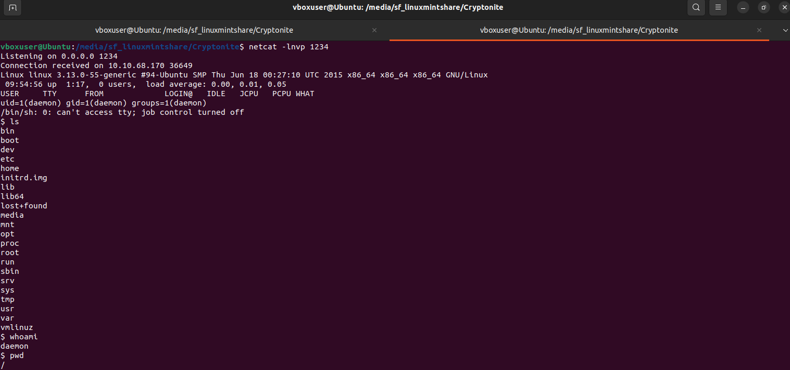
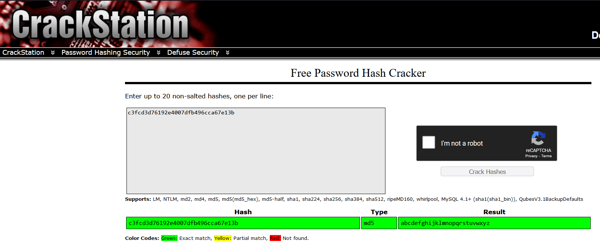
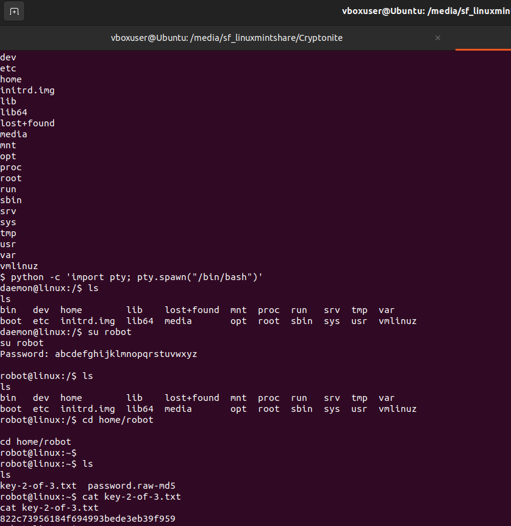
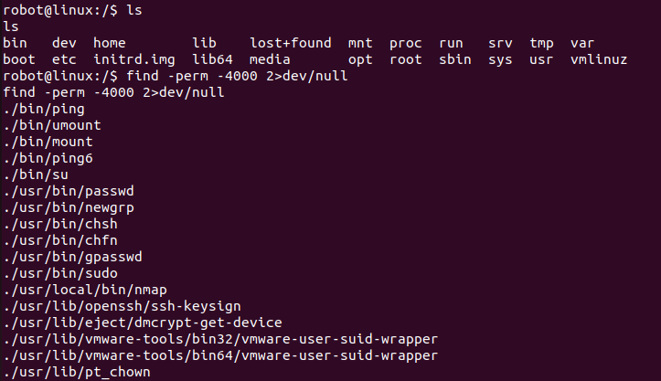
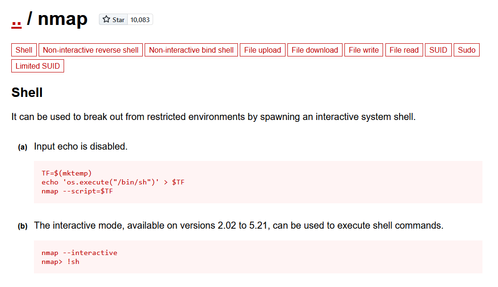
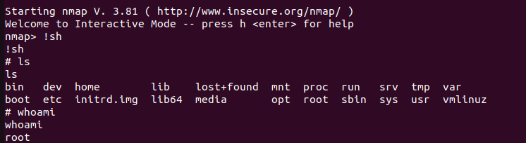

<h1>First steps</h1>
On entering we are give a sort of commmand line where we can enter some commands.
fsociety shows video saying "Are you ready to join fsociety"
prepare shows another video clip form the show.
inform shows some newspaper clippings about some articles and some comments.
question also shows some photos
wakeup shows another clip
join opens page with place to enter email address to join fsociety.

Viewed the source. Only helpful js file was the main-acba06a5.js.
Went though some of the code in the top. Found a link to images/420/420.jpg which was not shown in gallery. Also the /420 path directly did not exist.Ok entering 420 on the command list takes to the image.

Going to robots.txt showed two paths.


The first path gave the first key.
The other path downloaded a dictionary which I assume is a wordlist for some user account whose password I will have to crack using the wordlist.
Since I could not figure out any place to login in the normal commands displayed I decided to run gobuster on it to see if maybe there were other endpoints also.
This returned /sitemap,/intro,/wp-login,license,/readme

<h1>Logging in</h1>
After checking each of them the only one which looked to take things forward was the wp-admin endpoint. It had a login form. 
I had a personalised wordlist but I did not know the username.
So went through the login page and found that on the Lost password page it only accepted actual usernames.

So used Hydra to target the wordlist on that input page to get the username.
Used the command: ```hydra -L fsocity.dic -p '' http-post-form://10.10.178.60/wp-login.php?action=lostpassword:"user_login=^USER^&redirect_to=&wp-submit=Get+New+Password":"Invalid"```
and got back "Elliot" in under a second.


Ran Hydra for the login form but it did not find it even after five minutes.
I had to see the password from the solution because the wordlist was very long and it approximated 19hrs to go through it and the password was one the last in the wordlist.
It was "ER28-0652".

Using these credentials logged in as Admin for the wordpress account.


<h1>Reverse shell</h1>
Went through the plugins to see if any of the were exploitable but all were inactive.
Tried to find if there was some specific reverse shell vulnerablity in this Wordpress version but did not find anything eye catching.
Then got to know that Wordpress accepts themes as .php scripts. 
So uploaded [this](https://github.com/pentestmonkey/php-reverse-shell) script into the editor of 404.php page to get a reverse-shell. Changed the port to 1234 and ip to VPN ip of my machine.
To receive to the shell also set up a netcat listener on port 1234 using ```nc -lnvp 1234```.




Now on going to the 404.php page the script executes and we get a reverse shell but we are currently daemon, a low-level  with limited access.



Doing ```cat /etc/passwd``` shows there is another user named robot in the system.
Navigated to robot's home and found an md5 hash file and the 2nd key but acces to read it was denied.
So cracked the hash using crackstation and tried to log in as robot but the reverse shell was not interactive.
So had to open an interactive shell. 



Using ```SHELL=/bin/bash script -q /dev/null``` worked but the shell was messed up.
So used ```python -c 'import pty; pty.spawn("/bin/bash")'``` and it worked perfectly.
Used the pasword to log in as robot and get the key.



The next step obviously was priviledge escalation to root.For this I had recently learned about [GTFOBins](https://gtfobins.github.io/#) in a CTF challenge.
To find which binary to use ran ```find -perm -4000 2>dev/null```.
Here's a breakdown:

```find```: This is the command used to search for files in a directory hierarchy.

```-perm -4000```: This option tells find to only match files which have the setuid bit set. 
The setuid permission (represented by the 4000) allows a user who runs the file to have the same privileges as the owner of the file.

```2>dev/null```: This part of the command redirects standard error (2) to /dev/null, which is a special file that discards all data written to it (essentially “throwing away” the error messages).
This is often done to suppress error messages from the command.

So, in short, this command will find all files in the current directory (and its subdirectories) that have the setuid bit set, 
and it will not display any error messages. This can be useful for finding potential security risks, as files with the setuid bit can sometimes be exploited for privilege escalation. 



Out of the binaries on the list only nmap had an binary in GTFObins. So used that to gain root.






The key was located in ~/root.
 

 
 
And its done!


<h1>Additional commmands</h1>


<h1>Final learnings:</h1>

 Using gobuster and Hydra
 
 PHP reverse shell
 
 SUID
 
 Priviledge escalation
