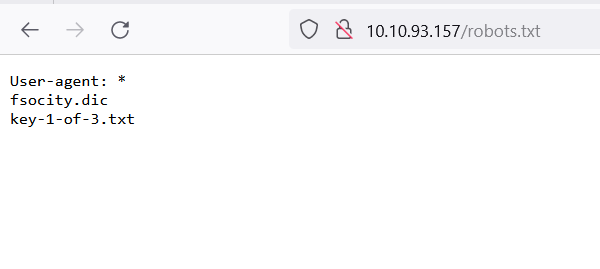
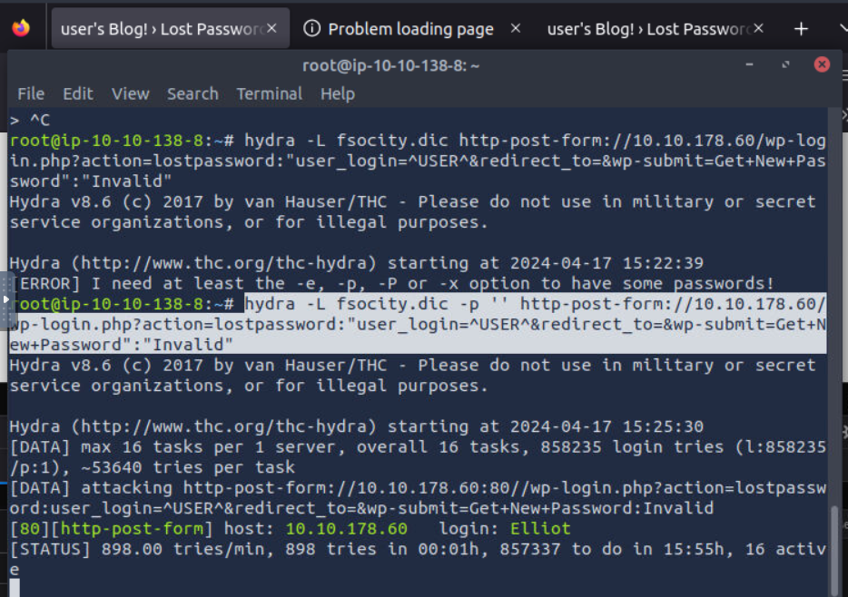

On entering we are give a sort of commmand line where we can enter some commands.
fsociety shows video saying "Are you ready to join fsociety"
prepare shows another video clip form the show.
inform shows some newspaper clippings about some articles and some comments.
question also shows some photos
wakeup shows another clip
join opens page with place to enter email address to join fsociety.

Viewed the source. Only helpful js file was the main-acba06a5.js.
Went though some of the code in the top. Found a link to images/420/420.jpg which was not shown in gallery. Also the /420 path directly did not exist.Ok entering 420 on the command list takes to the image.

Going to robots.txt showed two paths.


The first path gave the first key.
The other path downloaded a dictionary which I assume is a wordlist for some user account whose password I will have to crack using the wordlist.
Since I could not figure out any place to login in the normal commands displayed I decided to run gobuster on it to see if maybe there were other endpoints also.
This returned /sitemap,/intro,/wp-login,license,/readme

After checking each of them the only one which looked to take things forward was the wp-admin endpoint. It had a login form. 
I had a personalised wordlist but I did not know the username.
So went through the login page and found that on the Lost password page it only accepted actual usernames.

So used Hydra to target the wordlist on that input page to get the username.
Used the command: ```hydra -L fsocity.dic -p '' http-post-form://10.10.178.60/wp-login.php?action=lostpassword:"user_login=^USER^&redirect_to=&wp-submit=Get+New+Password":"Invalid"```
and got back "Elliot" in under a second.



Ran Hydra for the login form but it did not find it even after five minutes.
I had to see the password from the solution because the wordlist was very long and it approximated 19hrs to go through it and the password was one the last in the wordlist.
It was "ER28-0652".

Using these credentials logged in as Admin for the wordpress account. Went through the plugins to see if any of the were exploitable but all were inactive.Tried to find if there was some specific reverse shell vulnerablity in this Wordpress version but did not find anything eye catching.
